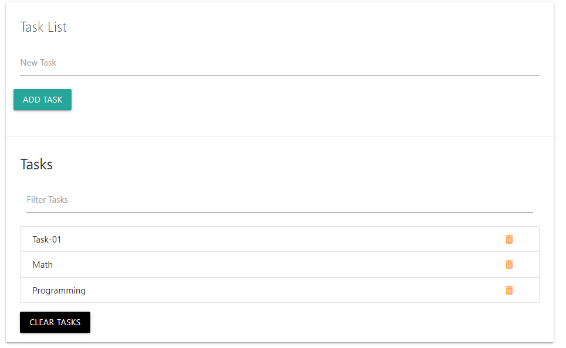

# JavaScript Task Manager App

Welcome to the JavaScript Task Manager App! This is a simple web application that allows you to create tasks and store them in the client's local storage. Once a task is completed, you can easily delete it from the local storage. This app is built using JavaScript and utilizes the local storage API to manage tasks.




## Getting Started

To get started with the JavaScript Task Manager App, follow the instructions below:

1. Clone the repository to your local machine using the following command:
   ```
   git clone https://github.com/mahmoud-pro/javascript-task-manager.git
   ```

2. Open the `index.html` file in your preferred web browser.

## Usage

### Creating a Task

To create a new task, follow these steps:

1. In the app interface, enter the task description in the input field provided.

2. Press the "Add Task" button or hit Enter to add the task.

3. The task will be displayed in the task list below.

### Marking a Task as Completed

Once you have completed a task, you can mark it as done and remove it from the task list. Follow these steps:

1. Click on the checkbox next to the task you want to mark as completed.

2. The task will be crossed out to indicate that it has been completed.

3. The task will be automatically removed from the task list and deleted from local storage.

## Local Storage

The JavaScript Task Manager App uses the browser's local storage to store tasks. The local storage allows the app to persist data even if the page is refreshed or closed.


### Deleting Tasks

When a task is marked as completed, it is deleted from the local storage. This ensures that only active tasks are stored, and completed tasks do not clutter the storage.

## Contributing

Contributions are welcome! If you have any ideas, improvements, or bug fixes, feel free to open an issue or submit a pull request. Please make sure to follow the existing code style and guidelines.

## Contact

If you have any questions, suggestions, or feedback, you can reach out to the project maintainer at `GitHub Issues`.

---

Thank you for using the JavaScript Task Manager App! We hope it helps you stay organized and productive.